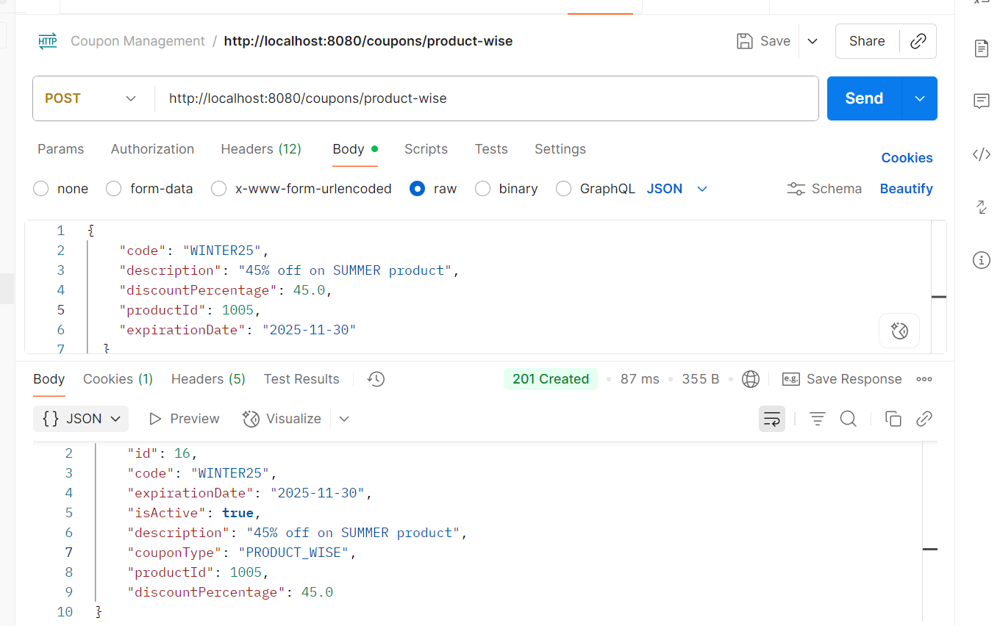
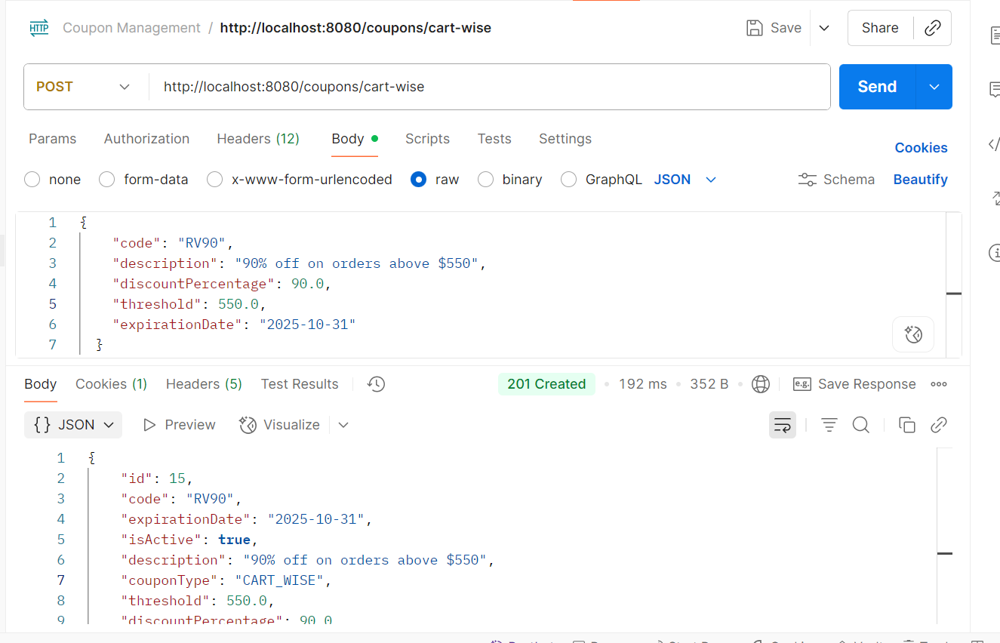
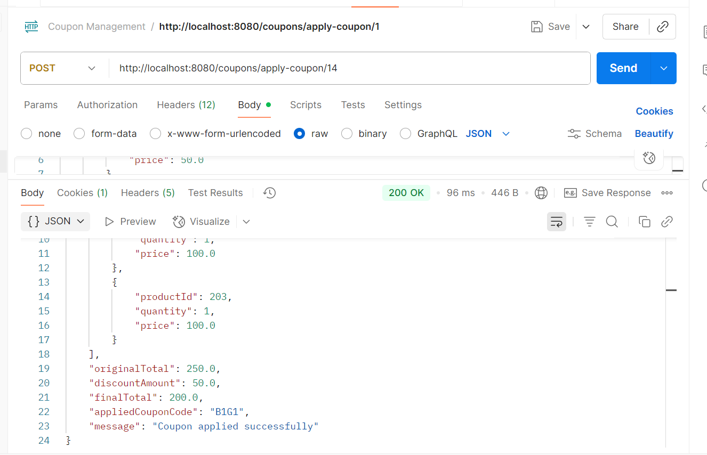
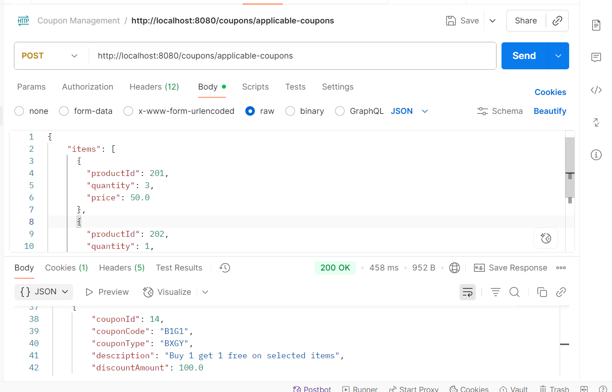
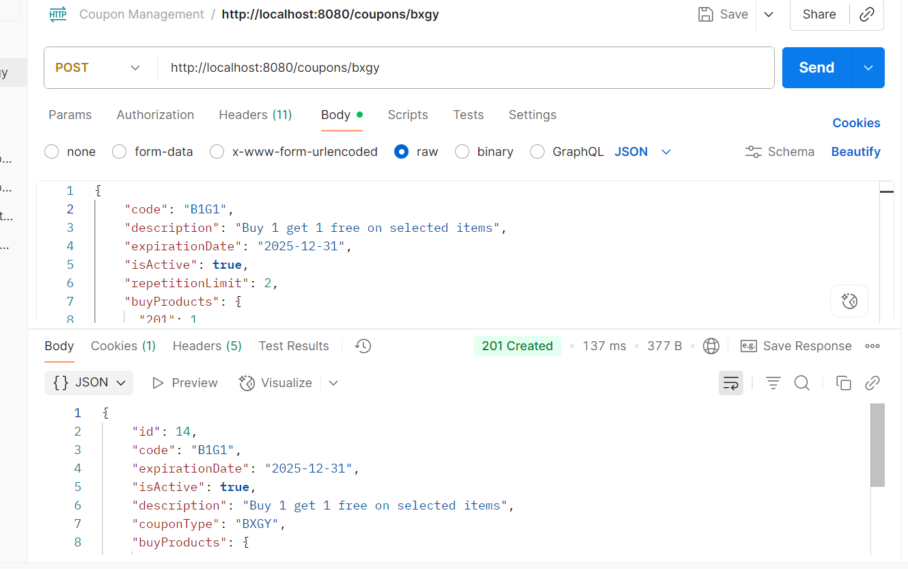
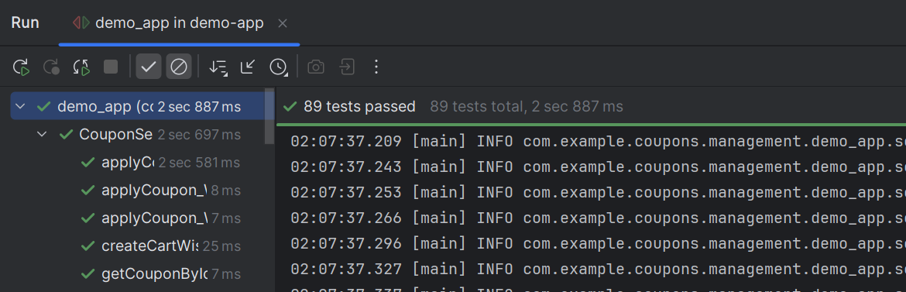

# E-Commerce Coupon Management System

A RESTful API for managing e-commerce discount coupons built with Spring Boot. This system provides a clean, maintainable, and extensible architecture for handling various coupon types and their application logic.

## 🚀 Features

- **Multiple Coupon Types**: Cart-wise, Product-wise, and Buy-X-Get-Y (BxGy) coupons
- **Smart Coupon Application**: Automatic detection of applicable coupons based on cart contents
- **Flexible Discount Calculation**: Support for percentage-based and quantity-based discounts
- **PostgreSQL Integration**: Robust database schema with proper constraints and indexing
- **RESTful API**: Clean and intuitive endpoints for all coupon operations
- **Input Validation**: Comprehensive validation with detailed error messages
- **Exception Handling**: Global error handling with meaningful responses

## 🛠 Tech Stack

- **Framework**: Spring Boot 3.5.5
- **Language**: Java 17
- **Build Tool**: Maven
- **Database**: PostgreSQL 12+ (Production), H2 (Development)
- **Schema**: `coupons` schema for organized data management
- **Testing Framework**: JUnit 5.10.1 (Jupiter) with Spring Boot Test
- **Dependencies**: 
  - spring-boot-starter-web
  - spring-boot-starter-data-jpa
  - spring-boot-starter-validation
  - spring-boot-starter-test (includes JUnit 5, Mockito, AssertJ)
  - postgresql
  - lombok
  - testcontainers (for integration testing)

## 📁 Project Structure

```
src/main/java/com/example/coupons/management/demo_app/
├── controller/                 # REST API endpoints
│   └── CouponController.java   # Main coupon management endpoints
├── dto/                        # Data Transfer Objects
│   ├── CartDTO.java           # Cart representation
│   ├── ItemDTO.java           # Cart item representation
│   ├── Create*CouponRequest.java  # Coupon creation requests
│   ├── CouponResponseDTO.java     # Coupon response format
│   ├── ApplicableCouponDTO.java   # Applicable coupon details
│   └── CouponApplicationResultDTO.java  # Application result
├── model/                      # JPA Entities
│   ├── CartWiseCoupon.java    # Cart-wise discount coupons
│   ├── ProductWiseCoupon.java # Product-specific coupons
│   ├── BxGyCoupon.java        # Buy-X-Get-Y coupons
│   ├── CouponEntity.java      # Common coupon interface
│   └── CouponType.java        # Coupon type enumeration
├── repository/                 # Data Access Layer
│   ├── CartWiseCouponRepository.java
│   ├── ProductWiseCouponRepository.java
│   └── BxGyCouponRepository.java
├── service/                    # Business Logic Interfaces
│   └── CouponService.java
├── serviceimpl/               # Business Logic Implementation
│   └── CouponServiceImpl.java
└── exception/                 # Exception Handling
    ├── GlobalExceptionHandler.java
    ├── CouponNotFoundException.java
    └── CouponNotApplicableException.java
```

## 🗄️ Database Schema

The application uses PostgreSQL with a dedicated `coupons` schema:

- **cart_wise_coupon**: Coupons with minimum cart value threshold
- **product_wise_coupon**: Product-specific discount coupons
- **bxgy_coupon**: Buy-X-Get-Y promotional coupons
- **bxgy_buy_products**: Required products for BxGy offers
- **bxgy_get_products**: Free products in BxGy offers
- **hibernate_sequence**: Shared sequence for ID generation

## 🚀 Quick Start

### Prerequisites
- Java 17 or higher
- Maven 3.6+
- PostgreSQL 12+

### Setup

1. **Clone the repository**
   ```bash
   git clone <repository-url>
   cd demo-app
   ```

2. **Database Setup**
   ```bash
   # Create database
   createdb coupon_management
   
   # Run schema script
   psql -d coupon_management -f create_all_tables.sql
   ```

3. **Configure Database**
   Update `src/main/resources/application.properties`:
   ```properties
   spring.datasource.url=jdbc:postgresql://localhost:5432/coupon_management?currentSchema=coupons
   spring.datasource.username=your_username
   spring.datasource.password=your_password
   ```

4. **Build and Run**
   ```bash
   mvn clean install
   mvn spring-boot:run
   ```

The application will start on `http://localhost:8080`

## 📚 API Documentation

### Coupon Management Endpoints

#### Create Coupons

**Create Cart-wise Coupon**
```http
POST /coupons/cart-wise
Content-Type: application/json

{
  "code": "CART10",
  "expirationDate": "2025-12-31",
  "description": "10% off on orders above $100",
  "threshold": 100.00,
  "discountPercentage": 10.00
}
```

**Create Product-wise Coupon**
```http
POST /coupons/product-wise
Content-Type: application/json

{
  "code": "PROD15",
  "expirationDate": "2025-12-31",
  "description": "15% off on Product 1001",
  "productId": 1001,
  "discountPercentage": 15.00
}
```

**Create BxGy Coupon**
```http
POST /coupons/bxgy
Content-Type: application/json

{
  "code": "BUY2GET1",
  "expirationDate": "2025-12-31",
  "description": "Buy 2 get 1 free on selected items",
  "buyProducts": {
    "201": 1,
    "202": 1,
    "203": 1
  },
  "getProducts": {
    "210": 1,
    "211": 1,
    "212": 1
  },
  "repetitionLimit": 2
}
```

#### Retrieve Coupons

**Get All Coupons**
```http
GET /coupons
```

**Get Specific Coupon**
```http
GET /coupons/{id}
```

#### Apply Coupons

**Find Applicable Coupons**
```http
POST /coupons/applicable-coupons
Content-Type: application/json

{
  "items": [
    {
      "productId": 201,
      "quantity": 1,
      "price": 50.0
    },
    {
      "productId": 202,
      "quantity": 1,
      "price": 100.0
    }
  ],
  "totalValue": 150.0
}
```

**Apply Specific Coupon**
```http
POST /coupons/apply-coupon/{couponId}
Content-Type: application/json

{
  "items": [
    {
      "productId": 201,
      "quantity": 1,
      "price": 50.0
    }
  ],
  "totalValue": 50.0
}
```

## 💡 Coupon Types Explained

### 1. Cart-wise Coupons
- **Trigger**: Minimum cart value threshold
- **Discount**: Percentage-based on total cart value
- **Example**: "10% off on orders above $100"

### 2. Product-wise Coupons
- **Trigger**: Specific product in cart
- **Discount**: Percentage-based on product price
- **Example**: "15% off on Product ID 1001"

### 3. BxGy (Buy-X-Get-Y) Coupons
- **Trigger**: Purchase specific combination of products
- **Discount**: Free products based on purchase
- **Features**: 
  - Multiple buy/get product combinations
  - Repetition limits
  - Smart applicability detection
  - Discount estimation based on cheapest buy products

## 🔧 Configuration

### Database Configuration
```properties
# PostgreSQL Configuration
spring.datasource.url=jdbc:postgresql://localhost:5432/coupon_management?currentSchema=coupons
spring.datasource.username=postgres
spring.datasource.password=your_password

# JPA Configuration
spring.jpa.hibernate.ddl-auto=none
spring.jpa.show-sql=true
spring.jpa.properties.hibernate.default_schema=coupons
```

### Logging Configuration
```properties
# Application Logging
logging.level.org.springframework.web=DEBUG
logging.level.org.hibernate.SQL=DEBUG
logging.level.org.hibernate.type.descriptor.sql.BasicBinder=TRACE
```

## 🧪 Testing

### Sample Test Data
The application includes sample data in `create_all_tables.sql`:
- Cart-wise coupons: CART10, CART20
- Product-wise coupons: PROD15, PROD25  
- BxGy coupon: BOGO (Buy 2 Get 1 Free)

### Testing Endpoints
```bash
# Test applicable coupons
curl -X POST http://localhost:8080/coupons/applicable-coupons \
  -H "Content-Type: application/json" \
  -d '{
    "items": [
      {"productId": 201, "quantity": 1, "price": 50.0},
      {"productId": 202, "quantity": 1, "price": 100.0},
      {"productId": 203, "quantity": 1, "price": 100.0}
    ],
    "totalValue": 250.0
  }'
```

### JUnit 5 Testing Examples

#### 1. Basic Test with JUnit 5
```java
import static org.junit.jupiter.api.Assertions.*;
import org.junit.jupiter.api.Test;

public class CouponServiceTest {

    @Test
    void testCalculateDiscount() {
        // Arrange
        CouponService couponService = new CouponService();
        double originalPrice = 100.0;
        double expectedDiscountedPrice = 90.0; // 10% discount

        // Act
        double actualDiscountedPrice = couponService.calculateDiscount(originalPrice, 10.0);

        // Assert
        assertEquals(expectedDiscountedPrice, actualDiscountedPrice);
    }
}
```

#### 2. Mocking with Mockito
```java
import static org.mockito.Mockito.*;
import org.junit.jupiter.api.Test;

public class CouponControllerTest {

    @Test
    void testCreateCartWiseCoupon() {
        // Arrange
        CouponService couponService = mock(CouponService.class);
        CouponController couponController = new CouponController(couponService);
        CreateCartWiseCouponRequest request = new CreateCartWiseCouponRequest("CART10", 100.0, 10.0);
        
        when(couponService.createCartWiseCoupon(request)).thenReturn(new CouponResponseDTO(1L, "CART10", 90.0));

        // Act
        ResponseEntity<CouponResponseDTO> response = couponController.createCartWiseCoupon(request);

        // Assert
        assertEquals(HttpStatus.CREATED, response.getStatusCode());
        assertEquals("CART10", response.getBody().getCode());
    }
}
```

#### 3. Integration Test with Testcontainers
```java
import org.junit.jupiter.api.Test;
import org.springframework.beans.factory.annotation.Autowired;
import org.springframework.boot.test.autoconfigure.web.servlet.AutoConfigureMockMvc;
import org.springframework.boot.test.context.SpringBootTest;

@SpringBootTest
@AutoConfigureMockMvc
public class CouponIntegrationTest {

    @Autowired
    private MockMvc mockMvc;

    @Test
    void testGetAllCoupons() throws Exception {
        mockMvc.perform(get("/coupons"))
               .andExpect(status().isOk())
               .andExpect(jsonPath("$", hasSize(greaterThan(0))));
    }
}
```

## 🏗️ Architecture Highlights

- **Clean Architecture**: Separation of concerns with controller, service, and repository layers
- **DTO Pattern**: Proper data transfer objects for API communication
- **Repository Pattern**: Abstracted data access with JPA repositories
- **Global Exception Handling**: Centralized error handling with meaningful responses
- **Input Validation**: Comprehensive validation using Bean Validation
- **Database Schema Design**: Optimized PostgreSQL schema with proper constraints and indexes

## 🔄 Recent Updates

- **Removed Authorization**: Service configured as internal system without authentication
- **Cleaned Codebase**: Removed unused methods and optimized imports
- **Enhanced BxGy Logic**: Improved discount calculation and applicability detection
- **PostgreSQL Integration**: Full migration from H2 to PostgreSQL with schema support
- **Performance Optimization**: Added database indexes for faster queries

## 🔮 Future Updates

### 🎯 Update 1: Real-time Coupon Analytics & Performance Dashboard 

**Business Impact**: Transform coupon management from reactive to data-driven decision making

#### Features:
- **Real-time Usage Metrics**: Track coupon redemptions, conversion rates, and revenue impact
- **Performance Analytics API**: RESTful endpoints for dashboard integration
- **Coupon ROI Calculator**: Measure cost vs. revenue generated by each coupon
- **Usage Trends**: Identify peak usage times, popular coupon types, and customer behavior patterns
- **Fraud Detection**: Monitor unusual redemption patterns and prevent coupon abuse

#### Technical Implementation:
```java
// New Analytics Service
@Service
public class CouponAnalyticsService {
    public CouponMetrics getCouponPerformance(String couponCode, LocalDate startDate, LocalDate endDate);
    public List<UsageTrend> getUsageTrends(String period);
    public ROIReport calculateROI(Long couponId);
    public List<FraudAlert> detectAnomalies();
}

// New Analytics Endpoints
@RestController
@RequestMapping("/analytics")
public class AnalyticsController {
    @GetMapping("/performance/{couponCode}")
    public CouponMetrics getPerformance(@PathVariable String couponCode);
    
    @GetMapping("/dashboard")
    public DashboardData getDashboardMetrics();
    
    @GetMapping("/roi-report")
    public List<ROIReport> getROIReport();
}
```

#### Database Extensions:
```sql
-- Coupon Usage Tracking
CREATE TABLE coupons.coupon_usage (
    id BIGINT PRIMARY KEY DEFAULT nextval('coupons.hibernate_sequence'),
    coupon_id BIGINT NOT NULL,
    user_id VARCHAR(255),
    cart_value DECIMAL(10,2) NOT NULL,
    discount_amount DECIMAL(10,2) NOT NULL,
    applied_at TIMESTAMP NOT NULL,
    session_id VARCHAR(255),
    
    FOREIGN KEY (coupon_id) REFERENCES coupons.bxgy_coupon(id),
    INDEX idx_coupon_usage_date (applied_at),
    INDEX idx_coupon_usage_coupon (coupon_id)
);

-- Real-time Metrics
CREATE TABLE coupons.coupon_metrics (
    coupon_id BIGINT PRIMARY KEY,
    total_uses INTEGER DEFAULT 0,
    total_discount_given DECIMAL(12,2) DEFAULT 0,
    total_revenue_impact DECIMAL(12,2) DEFAULT 0,
    avg_cart_value DECIMAL(10,2) DEFAULT 0,
    conversion_rate DECIMAL(5,4) DEFAULT 0,
    last_updated TIMESTAMP DEFAULT CURRENT_TIMESTAMP,
    
    FOREIGN KEY (coupon_id) REFERENCES coupons.bxgy_coupon(id)
);
```

#### Expected Benefits:
- **30% better ROI** through data-driven coupon optimization
- **Real-time insights** for immediate campaign adjustments  
- **Fraud prevention** saving 5-10% in potential losses
- **Customer behavior insights** for targeted marketing

---

## 📸 Screenshots

### Application Overview

*Example of creating a new Product coupon using the REST API*

### API Testing Examples

*Example of creating a new Cart coupon using the REST API*


*Demonstration of applying coupons to a shopping cart*


*Finding all applicable coupons for a given cart*


*Example of creating a new BXGY coupon using the REST API*


*Creating 89 JUnit Testcases with 100% Pass Rate*

---

## 📝 License

This project is licensed under the MIT License - see the LICENSE file for details.

## 🤝 Contributing

1. Fork the repository
2. Create a feature branch (`git checkout -b feature/amazing-feature`)
3. Commit your changes (`git commit -m 'Add some amazing feature'`)
4. Push to the branch (`git push origin feature/amazing-feature`)
5. Open a Pull Request

## 📞 Support
Developer:Vipul

Email: raovipul007@gmail.com

GitHub: @vipulyadav007

For support and questions, please open an issue in the repository.
